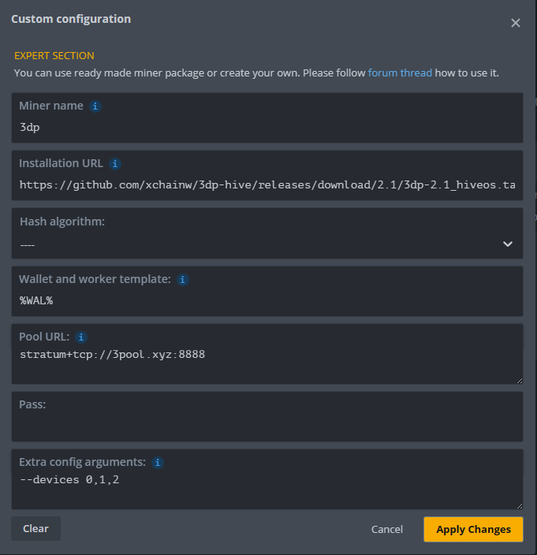

# 3DP HiveOS Miner
This is the integration of the 3dpass(3DP, P3D) miner from [3pool-miner](https://github.com/3poolxyz/3pool-miner-release) to HiveOS.


Use URL in HiveOS flight sheet:

https://github.com/xchainw/3dp-hive/releases/download/2.1/3dp-2.1_hiveos.tar.gz

## 3DP Resources

- [3DPass Website](https://3dpass.org/)
- [3DPass Web Wallet](https://wallet.3dpass.org/)
- [3DPass Mobile Wallet](https://3dpass.org/mobile-wallet)
- [3pool-miner]([3poolxyz/3pool-miner-release (github.com)](https://github.com/3poolxyz/3pool-miner-release))

## :warning: HiveOS Hardware Requirement
*Only NVIDIA GPU compatible*

## HiveOS Wallet Setup


## Flight Sheet Configuration


Setup Miner Config:


Extra config arguments exemple:

```
--devices 0,2
```

## :wrench: Hive OS Settings

### Miner Configuration

- **Miner name:** Automatically filled with the installation URL.
- **Installation URL:** `https://github.com/xchainw/3dp-hive/releases/download/2.1/3dp-2.1_hiveos.tar.gz`
- **Hash algorithm:** Not used, leave as `----`.
- **Wallet and worker template:** Your wallet address, You can use the hiveos wallet configuration parameter:  `%WAL%`。
- **Pool URL:** Not used, leave as `stratum+tcp://3pool.xyz:8888` or any other text.
- **Pass:** Not used
- **Extra config arguments:** 3pool-miner options, ref [document](https://github.com/3poolxyz/3pool-miner-release#options)。Frequently used `--devices 0,1,2`, It indicates that only the 3 GPU with sequence 0, 1, and 2 are used.


