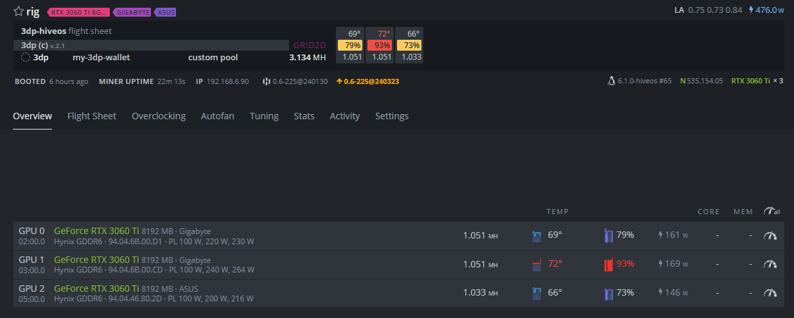
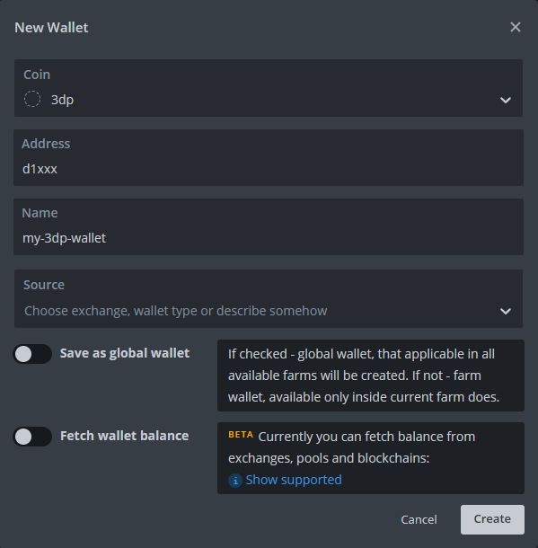
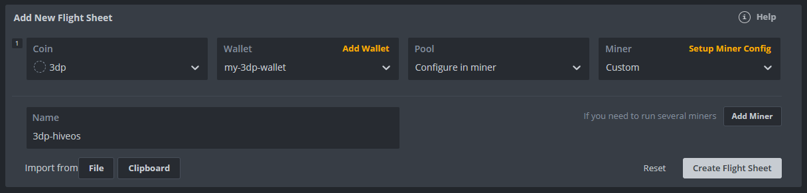
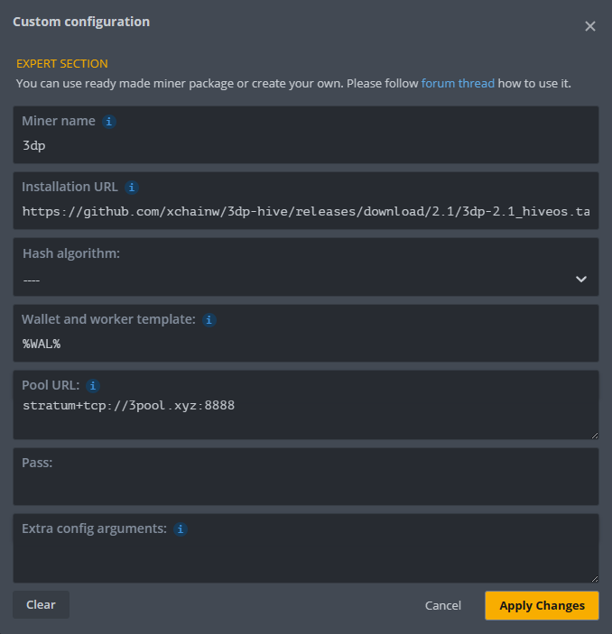

# 3DP HiveOS Miner
This is the integration of the 3dpass(3DP, P3D) miner from [3pool-miner](https://github.com/3poolxyz/3pool-miner-release) to HiveOS.



Use URL in HiveOS flight sheet:

https://github.com/xchainw/3dp-hive/releases/download/2.4/3dp-2.4_hiveos.tar.gz

## 3DP Resources

- [3DPass Website](https://3dpass.org/)
- [3DPass Web Wallet](https://wallet.3dpass.org/)
- [3DPass Mobile Wallet](https://3dpass.org/mobile-wallet)
- [3pool-miner](https://github.com/3poolxyz/3pool-miner-release)
- [3dpass stratum protocal](https://github.com/3poolxyz/StratumTranslationProxy/blob/main/3dpass-stratum-protocol.md)

## :warning: HiveOS Hardware Requirement
*Only NVIDIA GPU compatible*

*Only supports unencrypted connection or TLS 1.3.*

## HiveOS Wallet Setup



## Flight Sheet Configuration


Setup Miner Config:



Extra config arguments exemple:

```
--devices 0,2
```

## :wrench: Hive OS Settings

### Miner Configuration

- **Miner name:** Automatically filled with the installation URL.
- **Installation URL:** `https://github.com/xchainw/3dp-hive/releases/download/2.4/3dp-2.4_hiveos.tar.gz`
- **Hash algorithm:** Not used, leave as `----`.
- **Wallet and worker template:** Your wallet address, You can use the hiveos wallet configuration parameter:  `%WAL%`。
- **Pool URL:** Mining pool to mine on (or proxy)
    - Format: `host:port` or `ip:port`.
    - e.g. `stratum+tls://hk.3pool.xyz:3443` or `127.0.0.1:3333`.
- **Pass:** Not used
- **Extra config arguments:** 3pool-miner options, ref [document](https://github.com/3poolxyz/3pool-miner-release#options)。Frequently used `--devices 0,1,2`, It indicates that only the 3 GPU with sequence 0, 1, and 2 are used.


